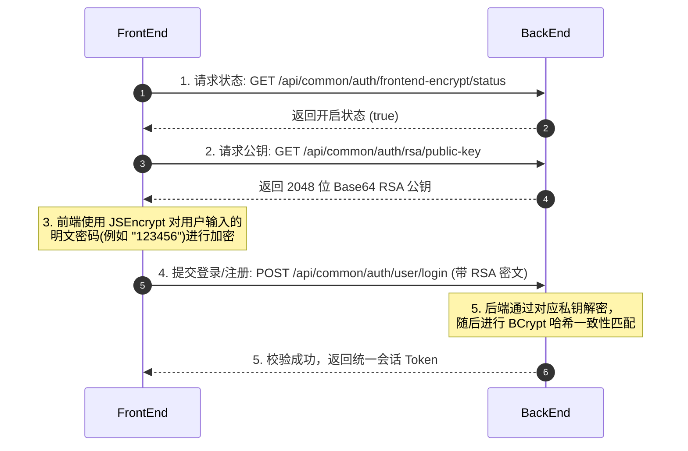

# Aegis-Boot (神盾) 前端对接与物理 API 接口详细规格说明书

本规范面向前端、移动端以及第三方系统对接开发人员。
**Aegis-Boot (神盾)** 采用了高安全、极致性能（Java 21 虚拟线程）和高度解耦的微服务化单体物理架构。为了确保通信过程中的最高防线，请在进行接口调用前务必仔细阅读本规范，并严格按照约定进行适配和对接。

---

## 📖 目录
1. [🛠 全局交互规范](#1-全局交互规范)
2. [🔒 核心安全防御：网络传输 RSA 密码加密](#2-核心安全防御网络传输-rsa-密码加密)
3. [🚀 零成本全局动态枚举映射](#3-零成本全局动态枚举映射)
4. [📁 事件驱动文件管理中心 (Aegis File Hub)](#4-事件驱动文件管理中心-aegis-file-hub)
5. [🔌 物理 API 接口分类详解](#5-物理-api-接口分类详解)
   - [公共服务公共通道 (Common)](#51-公共服务公共通道-common)
   - [认证与安全控制 (Auth)](#52-认证与安全控制-auth)
   - [C端用户个人中心 (My)](#53-c端用户个人中心-my)
   - [B端管理员：系统用户维护 (SysUser)](#54-b端管理员系统用户维护-sysuser)
   - [B端管理员：角色与权限管理 (SysRole)](#55-b端管理员角色与权限管理-sysrole)
   - [B端管理员：物理 API 扫描与同步 (SysApi)](#56-b端管理员物理-api-扫描与同步-sysapi)
   - [B端管理员：系统配置参数自适应 (SysConfig)](#57-b端管理员系统配置参数自适应-sysconfig)
   - [B端管理员：操作审计与安全日志 (SysLog)](#58-b端管理员操作审计与安全日志-syslog)
   - [B端管理员：系统文件后台运维 (SysFile)](#59-b端管理员系统文件后台运维-sysfile)
   - [通用安全控制器 CRUD 基础集 (BaseController)](#510-通用安全控制器-crud-基础集-basecontroller)
6. [🔌 Axios 高级配置模板 (JavaScript / TypeScript)](#6-axios-高级配置模板-javascript--typescript)

---

## 🛠 1. 全局交互规范

### 1.1 基础请求信息
- **接口服务默认端口**：`8080` (由后端 `server.port` 指定)
- **请求内容类型 (Content-Type)**：默认采用 `application/json;charset=utf-8`。对于文件上传采用 `multipart/form-data`。

### 1.2 统一响应报文格式 `Result<T>`
所有的物理 API 响应（无论是成功、业务失败、还是安全拦截报错），其外层包裹数据结构均完全一致：
```json
{
  "code": 200,          // 业务状态码 (200 代表成功，非 200 代表异常)
  "message": "操作成功", // 提示信息 / 详细报错文案
  "data": null          // 响应载体数据 (可能为 null，Object，数组等)
}
```

### 1.3 核心业务状态码 `ResultCode` 对照表
后端对可能发生的各种异常进行了细粒度归类，前端必须捕获对应的状态码，并执行相应的拦截或交互反馈：

| 类别 | 状态码 (Code) | 描述 (Message) | 前端推荐处理决策 |
| :--- | :--- | :--- | :--- |
| **通用** | `200` | 操作成功 | 正常渲染，执行后续交互 |
| | `2001` | 操作失败 / 通用异常 | 弹出 Toast 强提示错误信息 |
| **参数校验** | `4001` | 参数无效 | 提示字段格式有误 |
| | `4002` | 参数为空 | 阻止空提交 |
| | `4003` | 参数类型错误 | 拦截并修正输入数据类型 |
| | `4004` | 参数缺失 | 字段缺失提醒 |
| **会话/安全** | `1001` | 当前会话未登录 | 强行清空本地缓存，重定向至登录页 |
| | `1002` | 未能读取到有效Token | 引导用户登录 |
| | `1003` | Token无效 | 提示会话失效并清空缓存 |
| | `1004` | Token已过期 | 引导重新登录 / 自动静默置换 |
| | `1005` | Token已被顶下线 | 弹窗：您的账号在另一处登录，已被迫下线 |
| | `1006` | Token已被踢下线 | 弹窗：您的账号被管理员强制踢下线，请重新登录 |
| | `1007` | Token已被冻结 | 提示账号处于冻结状态 |
| | `1008` | 无权限，请联系管理员 | 拦截页面展示、弹窗警告拒绝访问 |
| | `1009` | 无此角色权限 | 权限按钮置灰或隐藏 |
| | `1010` | 防火墙拦截 | Sa-Firewall 防火墙检测到危险攻击字符 |
| **底层系统** | `5001` | 系统繁忙，未知错误，请稍后再试 | 通用兜底大崩溃警告 |
| | `5002` | 数据库操作异常 | 底层报错，记录运维代码 |
| | `5003` | 不支持的请求方法 | 检验 Method 是否为 GET/POST/PUT/DELETE |
| | `5004` | 您访问的资源不存在 | 404 引导 |
| **业务错误** | `6001` | 业务执行异常 | 抛出具体业务错误信息 |

### 1.4 双端会话物理强隔离机制
神盾安全架构对 **C端用户 (USER)** 与 **B端管理端 (ADMIN)** 的登录态进行了**物理级隔离**。
- **B端管理系统登录**：会话托管于 `StpUtil` 校验域，其 API 资源由 `ADMIN` 权限拦截保护（例如 `/api/admin/**` 及 `/sys/**`）。
- **C端普通应用登录**：会话托管于 `StpUserUtil` 校验域，其 API 资源由普通 `USER` 会话保护（例如 `/api/user/**`）。
- **核心安全网关拦截**：
  - 如果持有 C 端 `USER` 权限的 Token 试图调用 B 端的 `/api/admin/**` 管理路由，网关拦截切面会启动物理隔离警报，直接抛出 `1008 (无权限)` 异常，并**特异性地将该单条高危越权审计日志落库写入系统数据库 `sys_log` 物理表**以供全天候雷达监控，同时前端必须予以拦截提示。
- **Token 传输媒介**：无论是在 C 端还是 B 端登录成功，返回的 Token 字符串在后续请求中**统一放入 HTTP 请求 Headers 的 `Authorization` 字段中传递**。

### 1.5 雪花算法高精度适配保障
- **背景**：后端所有的主键 ID 均为 Snowflake（雪花算法，`Long` 类型，占 64 位无符号整数）。由于 JavaScript 中的 `Number` 无法精确表示超过 `2^53 - 1` 的整型，直接接收会导致低位被截断为 0 造成严重精度丢失，导致后续操作提示“记录不存在”。
- **后端自动转产保障**：后端默认启用了 `jackson.long-to-string` 高精度引擎。
  - **Downlink (下行)**：后端向前端输出 JSON 时，所有实体中的 `Long` 类型 ID 已经在反序列化阶段**全自动转换为了字符串格式 String**（例如 `"1798364719283742910"`）。
  - **Uplink (上行)**：前端发起新增/编辑等请求（POST/PUT）传递 Body 参数时，直接将 ID 字段保持以**字符串 String 形式传入**，后端会全自动、无损地绑定转换回 Java 的 `Long`。

---

## 🔒 2. 核心安全防御：网络传输 RSA 密码加密

为了绝对防御“中间人监听嗅探”、“弱网络链路拦截明文”等攻击威胁，神盾框架内置了高防网络非对称密码传输链路。默认配置在 `aegis.security.auth.frontend-encrypt-enabled: true` 下开启。

### 2.1 整体加密提交流程


### 2.2 前端 `jsencrypt` 加密实现
前端开发需要安装 `jsencrypt`（Vue / React / 原生 HTML 皆兼容）：
```bash
npm install jsencrypt --save
```
或者在页面中引入：
```html
<script src="https://cdn.jsdelivr.net/npm/jsencrypt@3.3.2/bin/jsencrypt.min.js"></script>
```

**JavaScript / TypeScript 加密方法封装示例**：
```javascript
import JSEncrypt from 'jsencrypt';

/**
 * 非对称加密方法
 * @param {string} rawText 待加密原文 (例如密码)
 * @param {string} publicKey Base64 RSA 公钥
 * @returns {string} RSA 散列非对称密文 Base64 字符串
 */
export function rsaEncrypt(rawText, publicKey) {
  const encryptor = new JSEncrypt();
  encryptor.setPublicKey(publicKey);
  const encrypted = encryptor.encrypt(rawText);
  if (!encrypted) {
    throw new Error('RSA 非对称加密失败，请检查公钥格式');
  }
  return encrypted;
}
```

---

## 🚀 3. 零成本全局动态枚举映射

### 3.1 核心设计
传统的业务枚举（如：用户类型 ADMIN/USER、状态 0-禁用/1-正常）在前后端分离中，通常需要前端开发人员手动在 JS 文件里冗余维护一份 JSON 映射或 Filter。这带来了巨大的迭代沟通成本。
神盾系统启动时，通过反射机制自动扫描包下所有的 Java Enum，并缓存入 Redis 和 JVM 内存中。

### 3.2 动态获取枚举字典
- **全量获取**：`GET /api/common/enums/all`
- **单类获取**：`GET /api/common/enums/{enumName}` (其中 `{enumName}` 可以是驼峰形式或原类名，如 `resultCode` 或 `ResultCode`)

**返回的统一 JSON 数据格式**：
```json
{
  "code": 200,
  "message": "操作成功",
  "data": [
    { "value": "SUCCESS", "description": "操作成功" },
    { "value": "ERROR", "description": "操作失败" },
    { "value": "PARAM_IS_INVALID", "description": "参数无效" }
  ]
}
```
前端可直接将返回值绑定至 `<el-select>` (Element-UI) 或 `<v-select>` (Vuetify) 组件中，实现零多余编码、秒级同步。

---

## 📁 4. 事件驱动文件管理中心 (Aegis File Hub)

文件上传管理中心采用了事件驱动和策略模式。前端只需调用统一的上传接口，无需感知底层使用的是 `LOCAL` 本地存储还是 `ALIYUN_OSS` 阿里云存储。

### 4.1 通用上传规范
- **请求端点**：`POST /api/common/file/upload` (必须携带 Header: `Authorization`)
- **传输格式 (FormData)**：
  - `file` (文件对象，参数名固定为 `file`)
  - `bizId` (可选，关联的业务ID，如商品ID，用户ID)
  - `bizType` (可选，业务类型，如 `avatar`，`product_image`)
  - `path` (可选，子路径目录，默认 `default`)

**返回的 `SysFile` 承载结构**：
```json
{
  "code": 200,
  "message": "操作成功",
  "data": {
    "id": "1802384719283742910",
    "originalName": "avatar.jpg",
    "storageBucket": "uploads",
    "storagePath": "default/20260616_abcdef.jpg",
    "fileSize": 102450,
    "fileType": "image/jpeg",
    "bizId": "180023847192",
    "bizType": "avatar",
    "fileUrl": "http://localhost:8080/uploads/default/20260616_abcdef.jpg", // 动态环境拼接的真实外网访问链
    "metadata": "{}", // 业务可自扩展的 JSON 元数据字段
    "createTime": "2026-06-16 22:30:00",
    "updateTime": "2026-06-16 22:30:00"
  }
}
```

### 4.2 环境无忧动态域名机制
- 神盾不会在数据库 `SysFile` 表的 `file_url` 字段中存入带域名的绝对地址（例如 `http://localhost:8080/uploads/...`）。
- 数据库仅记录 `storage_path`。当向前端返回文件对象时，后端会自动提取 `file.local.domain` 实时拼接动态 URL 并在 `fileUrl` 输出。
- **优点**：若服务器由于搬迁、上云等导致域名更换，历史上传文件的链接不会失效，直接在 `application.yml` 里修改配置域名，前端获取到的 `fileUrl` 会自动映射最新链接，免去批量修改历史数据的痛苦。

---

## 🔌 5. 物理 API 接口分类详解

### 5.1 公共服务公共通道 (Common)

#### 5.1.1 获取真实客户端 IP
- **物理路径**：`GET /api/common/client-ip`
- **鉴权**：匿名放行 (无需 Token)
- **响应载体示例 (`Result<Map<String, Object>>`)**：
```json
{
  "code": 200,
  "message": "操作成功",
  "data": {
    "ip": "127.0.0.1",
    "country": "XX",
    "region": "内网IP",
    "city": "内网",
    "isp": "局域网",
    "headers": {
      "user-agent": "Mozilla/5.0 ...",
      "x-forwarded-for": null
    }
  }
}
```

#### 5.1.2 获取系统内全部反射缓存枚举
- **物理路径**：`GET /api/common/enums/all`
- **鉴权**：匿名放行
- **响应载体示例**：返回全系统所有 Class 映射的 Key-Value 列表。

#### 5.1.3 单个获取指定枚举明细
- **物理路径**：`GET /api/common/enums/{enumName}`
- **鉴权**：匿名放行
- **响应载体示例**：返回指定枚举的 `value` 与 `description` 对象数组。

#### 5.1.4 获取可用第三方社交平台通道列表
- **物理路径**：`GET /api/common/oauth/platforms`
- **鉴权**：匿名放行
- **响应载体示例**：
```json
{
  "code": 200,
  "message": "操作成功",
  "data": [
    { "code": "github", "name": "GitHub", "enabled": true },
    { "code": "gitee", "name": "Gitee", "enabled": false }
  ]
}
```

---

### 5.2 认证与安全控制 (Auth)

#### 5.2.1 获取前端网络传输加密开启状态
- **物理路径**：`GET /api/common/auth/frontend-encrypt/status`
- **鉴权**：匿名放行
- **响应载体 (`Result<Boolean>`)**：`true` 启用 / `false` 禁用。

#### 5.2.2 获取传输加密公钥 (2048位 RSA)
- **物理路径**：`GET /api/common/auth/rsa/public-key`
- **鉴权**：匿名放行 (必须在前端加密开关开启状态下才能成功返回)
- **响应载体 (`Result<String>`)**：Base64 编码的 RSA 公钥字符串。

#### 5.2.3 C端普通用户端 密码安全注册
- **物理路径**：`POST /api/common/auth/user/register`
- **请求入参**：
```json
{
  "username": "user_test",
  "password": "MIIBIjANBgkqhkiG9w0BAQEFAAOCAQ8AMIIBCgKCAQEA..." // 如果开启前端传输加密，则为 RSA 公钥加密后的密文
}
```
- **响应载体**：`code: 200` 代表注册成功。

#### 5.2.4 C端普通用户端 密码登录
- **物理路径**：`POST /api/common/auth/user/login`
- **请求入参**：同上。
- **响应载体 (`Result<LoginResultVO>`)**：
```json
{
  "code": 200,
  "message": "操作成功",
  "data": {
    "token": "a1b2c3d4-e5f6-7a8b-9c0d-e1f2a3b4c5d6",
    "userInfo": {
      "id": "1800000000000000001",
      "username": "user_test",
      "userType": "USER",
      "status": 0,
      "createTime": "2026-06-16 22:30:00",
      "updateTime": "2026-06-16 22:30:00"
    },
    "roles": ["normal_user"],
    "permissions": ["/api/user/my/profile:GET", "/api/common/file/upload:POST"]
  }
}
```

#### 5.2.5 B端管理端 物理隔离安全登录
- **物理路径**：`POST /api/common/auth/admin/login`
- **说明**：此接口专门用于 ADMIN 管理员登录，对普通 `USER` 的账号在此登录会触发 "Aegis Auth Guard" 物理越权警报，阻断登录并产生高危落库日志。
- **请求入参**：
```json
{
  "username": "admin",
  "password": "MIIBIjANBgkqhkiG9w0BAQEFAAOCAQ8AMIIBCgKCAQEA..."
}
```
- **响应载体 (`Result<LoginResultVO>`)**：
```json
{
  "code": 200,
  "message": "操作成功",
  "data": {
    "token": "uuid-token-string...",
    "userInfo": {
      "id": "1802384719283742901",
      "username": "admin",
      "userType": "ADMIN",
      "status": 0,
      "createTime": "2026-06-01 10:00:00",
      "updateTime": "2026-06-01 10:00:00"
    },
    "roles": ["super_admin"],
    "permissions": ["*:*"] // 超级管理员拥有全端无注解直接通行规则
  }
}
```

#### 5.2.6 第三方社交登录重定向渲染
- **物理路径**：`GET /api/common/oauth/render/{source}`
- **说明**：其中 `{source}` 为 `github` 或 `gitee`。
- **响应载体 (`Result<String>`)**：返回拼接后的三方授权引导 URL。前端可直接利用 `window.location.href` 重定向。

#### 5.2.7 第三方 OAuth 回调端点
- **物理路径**：`GET /api/common/oauth/callback/{source}`
- **说明**：由三方登录授权成功后，回调服务器后。后端自动执行“绑定注册并发放 Token”，直出高品质毛玻璃 HTML 页供前端复制/重定向拦截。

---

### 5.3 C端用户个人中心 (My)
本模块下的所有 API 请求**必须携带 C 端用户的 `Authorization` 会话头**。

#### 5.3.1 修改自我基本资料
- **物理路径**：`PUT /api/user/my/info`
- **请求入参**：
```json
{
  "username": "new_my_username" // 支持自行修改账号用户名 (进行去重判定)
}
```
- **响应载体**：`code: 200` 代表修改成功。

#### 5.3.2 修改自我登录密码
- **物理路径**：`POST /api/user/my/password`
- **请求入参**：
```json
{
  "oldPassword": "旧密码密文", // 保持相同 RSA 密文或明文
  "newPassword": "新密码密文"  // 新密码密文，必须 >= 6位
}
```
- **响应载体**：修改密码成功，服务端会自动踢其下线并作退登处理。返回操作成功，前端需立刻清空缓存返回登录页。

#### 5.3.3 获取个人中心完整资料
- **物理路径**：`GET /api/user/my/profile`
- **响应载体 (`Result<UserProfileVO>`)**：包含 `userInfo` 资料、`roles` 角色列表、`permissions` 的 API 权限拦截颗粒度匹配集合。

---

### 5.4 B端管理员：系统用户维护 (SysUser)
本模块为 B 端管理员的高防管理端。**必须携带 ADMIN 的 `Authorization` 会话头**。

#### 5.4.1 用户列表分页查询 (含社交绑定与级联角色)
- **物理路径**：`GET /api/admin/sys-user/list`
- **Query 参数**：
  - `current` (当前页，默认 1)
  - `size` (页大小，默认 10)
  - `username` (可选，登录账号模糊搜索)
  - `status` (可选，状态，0-正常，1-禁用)
  - `userType` (可选，类型，ADMIN/USER)
- **响应载体 (`Result<Page<SysUserVO>>`)**：
```json
{
  "code": 200,
  "message": "操作成功",
  "data": {
    "records": [
      {
        "id": "1802384719283742901",
        "username": "admin",
        "userType": "ADMIN",
        "status": 0,
        "createTime": "2026-06-01 10:00:00",
        "updateTime": "2026-06-01 10:00:00",
        "socials": [], // 绑定的第三方社交账号明细数组
        "roles": [
          { "id": "1802384719283742000", "roleName": "超级管理员", "roleKey": "super_admin", "status": 0 }
        ]
      }
    ],
    "total": 1,
    "size": 10,
    "current": 1
  }
}
```

#### 5.4.2 新增后台账号
- **物理路径**：`POST /api/admin/sys-user/create`
- **说明**：可创建 `ADMIN` 或 `USER` 账号。
- **请求入参**：
```json
{
  "username": "tester",
  "password": "RSA密文/明文密码",
  "userType": "ADMIN", // ADMIN 或 USER
  "status": 0 // 0-正常，1-禁用
}
```
- **响应载体**：`code: 200` 代表创建成功。

#### 5.4.3 编辑修改账户资料
- **物理路径**：`PUT /api/admin/sys-user/update`
- **说明**：具有高防保护：超级管理员或当前自己登录的管理员账号**绝对不允许禁用自己或将自我降级为普通 `USER`**。
- **请求入参**：
```json
{
  "id": "1802384719283742901",
  "username": "new_username",
  "status": 0,
  "userType": "ADMIN"
}
```
- **响应载体**：操作成功，会自动清除受影响用户的 API 网关权限缓存。

#### 5.4.4 重置他人密码
- **物理路径**：`POST /api/admin/sys-user/reset-password`
- **请求入参**：
```json
{
  "userId": "1800000000000000002",
  "newPassword": "新密码RSA密文/明文"
}
```
- **响应载体**：重置成功，**同时会强行踢其物理下线退登，并完全清除其 Redis 网关拦截缓存**。

#### 5.4.5 级联物理删除用户
- **物理路径**：`DELETE /api/admin/sys-user/delete/{id}`
- **说明**：核心防守：**正在登录的管理员无法物理删除自己**。执行后，系统会：
  1. 物理清空 `sys_user` 账号表；
  2. 极速级联物理清空 `sys_user_role` 用户角色映射表；
  3. 极速级联物理清空 `sys_user_social` 绑定的所有第三方社交账户关系；
  4. 清退会话并清除网关鉴权缓存。

#### 5.4.6 管理员自身信息修改
- **物理路径**：`PUT /api/admin/sys-user/my-info`
- **请求入参**：仅允许传入并修改自我的 `username` (进行防重判定)。

#### 5.4.7 管理员自身密码修改
- **物理路径**：`POST /api/admin/sys-user/my-password`
- **请求入参**：包含自我的 `oldPassword` 和 `newPassword`。修改成功后，系统会强制退登。

#### 5.4.8 管理员自身 Profile 获取
- **物理路径**：`GET /api/admin/sys-user/profile`
- **响应载体**：返回自我的基本资料（含有角色及 API 权限映射集合）。

---

### 5.5 B端管理员：角色与权限管理 (SysRole)

#### 5.5.1 系统角色列表分页查询
- **物理路径**：`GET /api/admin/sys-role/list`
- **Query 参数**：`current` (当前页), `size` (页大小), `roleName` (模糊匹配), `roleKey` (标识模糊), `status` (0-正常, 1-禁用)
- **响应载体**：`Result<Page<SysRole>>`。

#### 5.5.2 创建新系统角色
- **物理路径**：`POST /api/admin/sys-role/create`
- **请求入参**：
```json
{
  "roleName": "系统运维员",
  "roleKey": "ops", // 必须唯一去重
  "status": 0
}
```

#### 5.5.3 编辑修改角色信息
- **物理路径**：`PUT /api/admin/sys-role/update`
- **高防盾校验**：内置角色 `super_admin`（超级管理员）与 `admin`（系统管理员）的 `roleKey` **绝对不容许修改**。

#### 5.5.4 删除角色并物理级联
- **物理路径**：`DELETE /api/admin/sys-role/delete/{id}`
- **高防盾校验**：内置的 `super_admin` 和 `admin` 角色**在任何场景下均被底层代码锁死拒绝删除**。普通角色删除后，会物理级联清空 `sys_user_role` 与 `sys_role_api` 表中的映射。

#### 5.5.5 为角色分配物理 API 接口权限
- **物理路径**：`POST /api/admin/sys-role/assign-apis`
- **请求入参**：
```json
{
  "roleId": "1802384719283742001",
  "apiIds": ["1801237481237498101", "1801237481237498102"] // 分配物理 API 的 ID 数组
}
```
- **响应载体**：分配成功，**后端会实时重置并拉退所有受影响在线用户的鉴权缓存，权限实时生效**。

#### 5.5.6 为用户分配角色
- **物理路径**：`POST /api/admin/sys-role/assign-to-user`
- **请求入参**：
```json
{
  "userId": "1800000000000000002",
  "roleIds": ["1802384719283742001"]
}
```
- **响应载体**：分配成功，受影响用户的鉴权缓存同样实时重置。

#### 5.5.7 获取角色已绑定的物理 API ID 列表
- **物理路径**：`GET /api/admin/sys-role/api-ids/{roleId}`
- **响应载体 (`Result<List<String>>`)**：已绑定的物理 API 的 Snowflake ID 字符串列表（防高精度丢失）。

---

### 5.6 B端管理员：物理 API 扫描与同步 (SysApi)

神盾资源摒弃了过时的硬编码注解（如 `@SaCheckPermission`），物理路由是由后端在项目启动时通过 Spring 机制物理扫描 Controller 并自动无感同步在表中的。

#### 5.6.1 物理 API 列表查询
- **物理路径**：`GET /api/admin/sys-api/list`
- **Query 参数**：`current` (当前页), `size` (页大小), `apiName` (物理中文接口名称), `path` (路由路径, 如 `/api/admin/**`), `method` (GET/POST/PUT/DELETE), `module` (业务模块归属)。
- **响应载体**：`Result<Page<SysApi>>`。

#### 5.6.2 编辑物理 API 信息
- **物理路径**：`PUT /api/admin/sys-api/update`
- **入参**：支持对 `apiName` (接口别名 / 描述描述) 与 `status` (0-正常可用, 1-禁用) 进行修改。

#### 5.6.3 物理删除废弃 API 资源
- **物理路径**：`DELETE /api/admin/sys-api/delete/{id}`
- **说明**：会物理删除该 API 项并彻底级联清理 `sys_role_api` 中的无效关联。

#### 5.6.4 手动主动一键触发代码物理 API 扫描同步
- **物理路径**：`POST /api/admin/sys-api/sync-trigger`
- **说明**：当开发人员新增 Controller 接口，且无需重启服务时，管理员点击此“同步”按钮。神盾的 `SysApiScanner` 组件会立即启动，增量提取、注册最新接口，无感赋权自愈。

---

### 5.7 B端管理员：系统配置参数自适应 (SysConfig)

#### 5.7.1 配置分页查询列表
- **物理路径**：`GET /api/admin/sys-config/list`
- **Query 参数**：`current` (页码), `size` (页大小), `configKey` (键模糊), `configName` (名模糊), `status` (状态)
- **响应载体**：`Result<Page<SysConfig>>`。

#### 5.7.2 新增系统配置项
- **物理路径**：`POST /api/admin/sys-config/create`
- **请求入参**：
```json
{
  "configKey": "sys.user.default-avatar",
  "configValue": "http://domain.com/default.jpg",
  "configName": "默认头像配置",
  "remark": "当新注册用户无头像时展示",
  "status": 0
}
```

#### 5.7.3 编辑系统配置信息
- **物理路径**：`PUT /api/admin/sys-config/update`
- **高防盾校验**：核心配置参数 `sys.auth.rsa.public-key`（RSA 公钥）与 `sys.auth.rsa.private-key`（RSA 私钥）**禁止禁用！禁止更改其唯一 Key 的键名！**

#### 5.7.4 删除系统配置项
- **物理路径**：`DELETE /api/admin/sys-config/delete/{id}`
- **高防盾校验**：内置核心非对称流密钥参数**不容许物理删除**！

---

### 5.8 B端管理员：操作审计与安全日志 (SysLog)

#### 5.8.1 条件组合分页筛选 (安全日志只读)
- **物理路径**：`GET /sys/log/page`
- **说明**：系统日志管理**显式且强行封禁了写权限**（save、saveBatch、update、updateBatch 均不可调用）。
- **Query 参数**：
  - `current` (当前页)
  - `size` (每页大小)
  - `username` (操作人账号模糊)
  - `ip` (访问IP精确)
  - `url` (请求 URL 模糊)
  - `method` (GET/POST/PUT/DELETE)
  - `title` (接口描述名称模糊)
  - `businessType` (业务类型, INSERT/UPDATE/DELETE/SELECT)
  - `status` (执行状态, 1-成功, 0-失败)
  - `beginTime` (开始时间)
  - `endTime` (结束时间)
- **响应载体 (`Result<Page<SysLog>>`)**：按操作时间默认排在首位倒序。

#### 5.8.2 单条日志物理删除
- **物理路径**：`DELETE /sys/log/delete/{id}`

#### 5.8.3 批量日志删除
- **物理路径**：`DELETE /sys/log/deleteBatch`
- **说明**：批量删除需通过 Request Body 传入 ID 长整型数组（单次最大批上限为 100 条）。
- **请求入参**：
```json
["1802384719283742911", "1802384719283742912"]
```

---

### 5.9 B端管理员：系统文件后台运维 (SysFile)
提供对全系统所有已被持久化落库的系统文件记录（由 `FileUploadedEvent` 异步或同步监听自愈落库）的查询与清理。

#### 5.9.1 文件分页组合筛选
- **物理路径**：`GET /sys/file/page`
- **Query 参数**：
  - `current` (页码), `size` (大小)
  - `originalName` (文件名模糊搜索)
  - `bizType` (业务类型精确)
  - `bizId` (业务ID精确)
  - `storageBucket` (本地/云 Bucket 等值)

#### 5.9.2 系统通用文件基础增删改
本服务同样继承 `BaseController`，包含 `/save`、`/saveBatch`、`/delete/{id}`、`/deleteBatch`、`/update`、`/updateBatch`。接口定义详见 [CRUD基础集](#510-通用安全控制器-crud-基础集-basecontroller)。

---

### 5.10 通用安全控制器 CRUD 基础集 (BaseController)
神盾底座框架设计了泛型注入控制器 `BaseController`。项目中诸如 `SysLogController`、`SysFileController` 等业务控制器皆直接继承自此基类。这为它们赋予了一套**高度安全、防御性的单表原子事务 API**。

```text
基准服务路径 (以继承 BaseController 后的具体子类 RequestMapping 为准)
├── POST   /save             # 1. 单条通用物理保存 (成功返回实体详情)
├── POST   /saveBatch        # 2. 防御型批量新增 (上限限制 MAX_BATCH_SIZE=100 条)
├── DELETE /delete/{id}      # 3. 单条物理/逻辑删除 (事务控制)
├── DELETE /deleteBatch      # 4. 防御型批量删除 (上限 100 条，RequestBody 传入 ID 数组)
├── PUT    /update           # 5. 局部更新 (传入要修改的非空字段，由实体 ID 驱动安全更新)
├── PUT    /updateBatch      # 6. 防御型批量局部更新 (上限 100 条，任何一条失败均事务整体回滚)
└── GET    /page             # 7. 多条件分页组合查询 (子类重写 getQueryWrapper)
```

**关于批量删除 (deleteBatch) 的请求入参**：
必须使用 `DELETE` 请求，且 Body 类型为 `application/json`，内容为 ID 的 Long 字符串数组：
```json
["1801237481237498101", "1801237481237498102"]
```

---

## 🔌 6. Axios 高级配置模板 (JavaScript / TypeScript)

这是一份生产级别的网络请求配置。在 Vue / React 项目中直接引入即可完美解决：**雪花算法高精度 Long 还原**、**密码 RSA 传输加密自适应**、**B端和C端物理会话超时静默处理**等技术细节：

```typescript
import axios from 'axios';
import { rsaEncrypt } from './security'; // 引用上文封装的 RSA 加密方法

// 1. 创建 Axios 请求实例
const service = axios.create({
  baseURL: import.meta.env.VITE_API_BASE_URL || 'http://localhost:8080',
  timeout: 10000 // 10秒连接超时
});

// 2. 请求拦截器 (Request Interceptor)
service.interceptors.request.use(
  async (config) => {
    // A. 提取本地 Token (以 localStorage 为例) 并统一注入
    const token = localStorage.getItem('token');
    if (token) {
      // 必须与 sa-token.token-name: Authorization 对应一致
      config.headers['Authorization'] = token;
    }

    // B. 自适应网络传输密码加密防线
    // 过滤出所有登录或注册的相关请求，拦截明文密码并执行非对称高防散列加密
    const authUrls = ['/api/common/auth/user/login', '/api/common/auth/admin/login', '/api/common/auth/user/register'];
    if (config.url && authUrls.includes(config.url) && config.data && config.data.password) {
      try {
        // 先调用状态接口确认加密是否处于开启状态
        const encryptStatusRes = await axios.get(`${config.baseURL}/api/common/auth/frontend-encrypt/status`);
        if (encryptStatusRes.data.code === 200 && encryptStatusRes.data.data === true) {
          // 异步调取后端自生成高安全密码加密公钥
          const pubKeyRes = await axios.get(`${config.baseURL}/api/common/auth/rsa/public-key`);
          if (pubKeyRes.data.code === 200 && pubKeyRes.data.data) {
            const publicKey = pubKeyRes.data.data;
            // 执行 RSA 密文转换覆盖，完美对碰后端
            config.data.password = rsaEncrypt(config.data.password, publicKey);
          }
        }
      } catch (encryptError) {
        console.error('神盾安全链路拦截：前端 RSA 密码哈希失败，已退化为原始防护。', encryptError);
      }
    }

    return config;
  },
  (error) => {
    return Promise.reject(error);
  }
);

// 3. 响应拦截器 (Response Interceptor)
service.interceptors.response.use(
  (response) => {
    const res = response.data;

    // 自定义业务异常状态拦截对碰
    if (res.code !== 200) {
      // A. 会话失效拦截 (1001-未登录, 1003-Token无效, 1004-Token过期, 1005-被顶下线, 1006-被踢)
      const sessionCodes = [1001, 1002, 1003, 1004, 1005, 1006];
      if (sessionCodes.includes(res.code)) {
        console.warn('>>>>>> 会话警报：检测到登录态已失效，正在清除客户端缓存并执行重定向');
        localStorage.removeItem('token');
        localStorage.removeItem('userInfo');
        
        // 示例：提示用户并踢回登录
        alert(`登录状态失效：${res.message || '请重新登录'}`);
        window.location.href = '/login';
        return Promise.reject(new Error(res.message || '会话失效'));
      }

      // B. 默认 Toast 弹出错误
      console.error('神盾业务响应异常：', res.message);
      return Promise.reject(res);
    }

    return res;
  },
  (error) => {
    // 捕获网络层、防火墙硬拦截或服务器大崩溃等底层响应
    console.error('系统级别底大崩溃:', error);
    alert('网络繁忙或防火墙恶意拦截，请稍后再试。');
    return Promise.reject(error);
  }
);

export default service;
```
