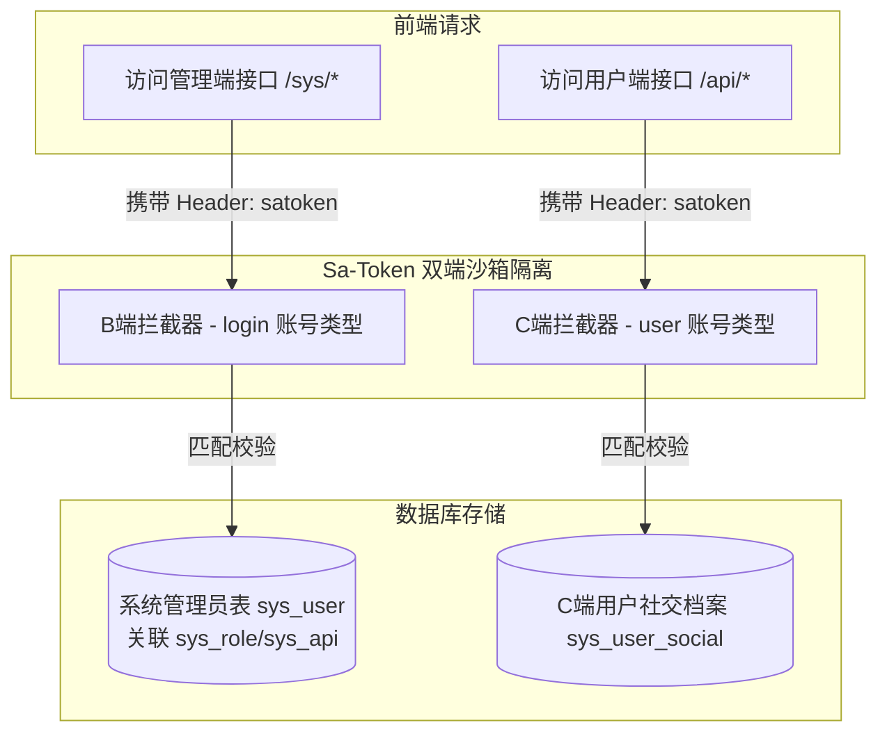
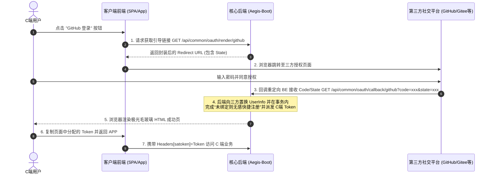

# Aegis-Boot (神盾) 前端对接与接口规范终极指南

本指南为 **Aegis-Boot (神盾 · 现代安全开发架构)** 的配套前端集成手册。涵盖了 **B端管理端（Admin）** 与 **C端用户端（Portal）** 的双端物理隔离会话机制、社交登录及快捷注册交互流程、公共服务、通用安全 CRUD（基于 `BaseController`）等核心接口规范。

---

## 1. 架构设计与统一协议

Aegis-Boot 采用标准的前后端分离、无状态分布式认证架构。在与后端接口通信时，必须严格遵守以下基础协议。

### 1.1 统一响应结构 `Result<T>`
无论调用何种业务接口、成功或失败，后端均返回一致的 JSON 格式：

```json
{
  "code": 200,
  "message": "操作成功",
  "data": { ... }
}
```

*   **`code`** (Integer): 状态码。`200` 代表业务处理成功，其余数值均为异常。
*   **`message`** (String): 接口返回的文字消息（如成功提示、校验失败、系统错误原因等）。
*   **`data`** (T): 承载的具体业务实体或分页对象，类型由具体接口决定；操作失败或无返回时为 `null`。

### 1.2 全局错误码对照表 (`ResultCode`)
当前端拦截到 `code != 200` 时，应根据以下标准错误码表做出相应的 UI 弹窗、路由拦截或清空本地会话的操作：

| 错误码 (`code`) | 默认提示消息 (`message`) | 分类 / 前端推荐处理行为 |
| :--- | :--- | :--- |
| **200** | 操作成功 | **放行**：执行正常的视图数据渲染。 |
| **2001** | 操作失败 | **提示**：普通业务失败，推荐 Toast 警告提示。 |
| **1001** | 当前会话未登录 | **重定向**：会话未登录，清空本地 Token 缓存并跳转回登录页。 |
| **1002** | 未能读取到有效Token | **重定向**：请求头缺失凭证，直接拦截并引导登录。 |
| **1003** | Token无效 | **重定向**：Token 伪造或校验不通过，引导至登录页。 |
| **1004** | Token已过期 | **重定向**：会话超时过期，清空状态并重新登录。 |
| **1005** | Token已被顶下线 | **重定向**：发生同账号异地挤占，弹出“异地登录”警示并重定向。 |
| **1006** | Token已被踢下线 | **重定向**：被管理员强制会话收回，弹出强制下线通知。 |
| **1007** | Token已被冻结 | **提示**：当前账号状态异常，无法执行敏感受限操作。 |
| **1008** | 无权限，请联系管理员 | **拒绝**：当前操作不具备 Path 权限，提示权限不足。 |
| **1009** | 无此角色权限 | **拒绝**：用户所属角色不匹配。 |
| **1010** | 防火墙拦截 | **警示**：请求参数触发 `Sa-Firewall` 安全过滤，拒绝访问并警告。 |
| **4001** | 参数无效 | **校验**：入参格式或约束未通过 Spring Validator 检验。 |
| **4002** | 参数为空 | **校验**：必填请求体为空。 |
| **4003** | 参数类型错误 | **校验**：如前端传 String 但后端绑定 Long。 |
| **4004** | 参数缺失 | **校验**：Querystring 中缺少必传参数。 |
| **5001** | 系统繁忙，未知错误，请稍后再试 | **兜底**：后端内部抛出未捕获异常，推荐展示统一友好报错页。 |
| **5002** | 数据库操作异常 | **故障**：后端 SQL 执行失败或事务冲突。 |
| **5003** | 不支持的请求方法 | **故障**：HTTP Method 错误（如本该 POST 但写成了 GET）。 |
| **5004** | 您访问的资源不存在 | **路由**：404 资源缺失。 |
| **6001** | 业务执行异常 | **提示**：核心业务逻辑抛出的异常，直接提示 message 信息。 |

### 1.3 请求凭证 (Token) 携带规范
Aegis-Boot 采用 Sa-Token 作为其底层安全中枢，前端在发起任何需要受限鉴权的 API 请求时，**必须在 Request Headers 中携带对应的会话凭证**：
*   **Header 名称**：`satoken` (全小写)
*   **值**：`Bearer [Token内容]` 或直接填入 `[Token内容]`（Sa-Token 框架会自动兼容读取）。

---

## 2. 双端会话物理隔离机制 (B端 VS C端)

Aegis-Boot 架构在底层对 **B端企业管理端** 与 **C端用户端/Portal端** 的账户体系、Token 分发、以及鉴权拦截器进行了物理上的“沙箱隔离”。前端开发在对接不同端点时，需注意其不同的会话特征。



### 2.1 B端管理端 (Admin 端)
*   **路由特征**：物理地址以 `/api/admin/**` 和 `/sys/**` 为前缀（例如操作日志检索 `/sys/log/page`、文件表格管理 `/sys/file/page` 等）。
*   **账户体系**：映射本地 `sys_user`，拥有后台管理权限。
*   **鉴权引擎**：采用 **无注解动态权限过滤器**。前端向后台发起的每次请求均会被安全网关强力抓取 `Path + Method`，并在 Redis 二级缓存中与该管理员拥拥有并在数据库中注册的 `sys_api` 权限集合进行实时高速对碰鉴权。未登录或无权调用的请求将直接抛出 11001（未登录）或 11041（未授权）异常，保证核心后台组件的安全完整性。


### 2.2 C端用户端 (Client / Portal 端)
*   **路由特征**：除第三方登录等公共白名单外，用户业务前缀通常为 `/api/user/**` 等受限端点。
*   **账户体系**：映射 `sys_user` C端档案，通常关联三方社交表 `sys_user_social`。
*   **鉴权引擎**：采用独立的 `StpUserUtil` 引擎（对应的会话类型为 `user`），Token 形式和 Redis Session 在底层与 B端 完全物理隔离，互不干涉。从而避免了 B/C 端由于共享同一 ID 字段（如 1 号用户）而产生的越权漏洞。

---

## 3. C端第三方社交登录与无感快捷注册流程

系统引入了 **JustAuth 1.16+** 多平台统一社交网关，支持前端在无需注册账号、输入密码的繁琐流程下，一键实现“授权 -> 无感注册本地账号并绑定 -> 登录 -> 获取 Token”的极速闭环。

### 3.1 社交授权时序图



### 3.2 步骤 1：获取第三方平台授权引导链接
前端不需要在本地拼接复杂的 OAuth 授权 URL（容易泄露配置且难以适应动态重定向），应向后端接口发起渲染请求：

*   **请求方式**：`GET`
*   **请求路径**：`/api/common/oauth/render/{source}`
    *   `{source}` 变量支持：`github`, `gitee`, `wechat`, `qq`, `weibo` 等（需在 application.yml 中配置）。
*   **入参参数**：无

#### 请求示例 (Axios)
```javascript
axios.get('/api/common/oauth/render/github')
  .then(res => {
    if(res.data.code === 200) {
      // 成功：获取到授权跳转地址
      const authorizeUrl = res.data.data;
      // 浏览器跳转至第三方平台进行授权
      window.location.href = authorizeUrl;
    }
  });
```

#### 响应示例
```json
{
  "code": 200,
  "message": "操作成功",
  "data": "https://github.com/login/oauth/authorize?response_type=code&client_id=123456&redirect_uri=http%3A%2F%2Flocalhost%3A8080%2Fapi%2Fcommon%2Foauth%2Fcallback%2Fgithub&state=d4b2e1c9a0ef45"
}
```

### 3.3 步骤 2：授权成功与 Token 获取
当用户在三方页面同意授权后，第三方平台会重定向回后端的统一接收端点：`/api/common/oauth/callback/{source}`。

#### 后端无感核心逻辑：
1. 后端根据 Code 与第三方进行通信，握手拉取用户的社交主页（UUID、昵称、头像等）。
2. **多账号绑定/自动建卡机制**：
    *   **情况 A**：该三方账号在此前已经绑定过系统：则一键执行快捷登录，并用三方最新的昵称/头像自动对本地数据库进行更正（信息自动纠偏）。
    *   **情况 B**：该账号为首次登录：系统在事务内自动生成前缀为 `oauth_` 的新 C 端本地用户，随后插入 `sys_user_social` 绑定主表，分步事务保证，安全闭环。
3. **分发 Token 会话**：采用 `StpUserUtil.login(userId)` 注册并生成 C 端专属 Token。

#### 前端如何捕获分配的 Token：
由于重定向是由浏览器直接发起的，为确保各种异构前端（微信小程序、原生 App、单页 Vue/React 应用）都能优雅兼容，Aegis-Boot 提供了两种极其方便的获取方式：

##### 方式一：一键复制交付视图 (极光暗黑毛玻璃回调 HTML)
回调验证成功后，后端会直出一段高规格的响应式 HTML。它提供：
*   **毛态视觉**：流动的极光渐变背景与磨砂毛玻璃微拟态卡片，具有奢华的设计质感；
*   **复制交互**：带有一键复制 Token 到系统剪贴板的按钮（含水波纹涟漪动效与成功反馈）。用户可以直接点击复制，并返回客户端主程序黏贴使用。

##### 方式二：单页应用/壳程序（SPA / WebView）注入监听
如果前端是嵌在 Cordova/Capacitor/WebView 壳子或单页应用中，可以在打开授权窗口后，通过监听 `message` 事件来截获 Token。
前端也可以用脚本在重定向页面中重写：
```javascript
// 在 SPA 页面中使用 window.open() 弹出授权页
const authWindow = window.open('http://localhost:8080/api/common/oauth/render/github');

// 监听窗口数据传送
window.addEventListener('message', (event) => {
  if (event.origin === 'http://localhost:8080') {
    const { token, source, nickname } = event.data;
    // 获取到会话 Token！存入 localStorage
    localStorage.setItem('user_token', token);
    authWindow.close();
  }
});
```

---

## 4. 前端通用安全 CRUD 交互规范 (BaseController API)

B端管理端中，绝大多数后台实体的 CRUD 均继承自 **`BaseController<T>`**。这提供了高度统一、参数防卫和操作限额的前端 API。

```
                    BaseController<T, S> (神盾通用控制器)
                                     │
      ┌──────────────┬───────────────┼──────────────┬──────────────┐
      ▼              ▼               ▼              ▼              ▼
 POST /save   POST /saveBatch   GET /page    PUT /update    DELETE /delete/{id}
```

> [!IMPORTANT]
> **并发与突时防卫限制**：
> 批量新增 (`saveBatch`)、批量局部更新 (`updateBatch`)、批量删除 (`deleteBatch`) 的单次批量条数上限严格被限制在 **`MAX_BATCH_SIZE = 100`** 条以内。超出 100 条的请求会被后端防火墙直接熔断并返回 `4001: 参数无效`。

### 4.1 通用条件分页查询：`GET /page`
作为数据表格的核心支撑，该接口支持接收分页参数以及实体的任意字段作为检索条件：

*   **请求方式**：`GET`
*   **Query 传参**：
    *   `current` (Long, 默认 `1`): 当前请求页码。
    *   `size` (Long, 默认 `10`): 每页显示条数（最大限制 100）。
    *   `[entityFields]` (Any): 可追加对应实体的任何成员属性。
        *   *默认规则*：所有非空属性在后端拼装为等值等号匹配 (`=`)。
        *   *高级重写*：支持子类覆盖重写，如 `SysLogController` 自动将 `username`、`url`、`title` 转换为带有防注入的安全模糊查询 (`LIKE %value%`)。

#### 请求示例 (SysLog 分页模糊查询)
```http
GET /sys/log/page?current=1&size=15&username=admin&status=1
```

#### 响应 JSON 结构 (MyBatis-Plus 分页承载)
后端成功时，会在 `data` 节点输出 MyBatis-Plus 的 `IPage` 标准分页包装。前端数据表格框架（如 Element Plus / Ant Design）需要解析此标准结构：

```json
{
  "code": 200,
  "message": "操作成功",
  "data": {
    "records": [
      {
        "id": "19958742131238912",
        "createTime": "2026-05-31 21:00:00",
        "updateTime": "2026-05-31 21:00:00",
        "username": "admin",
        "ip": "127.0.0.1",
        "url": "/sys/log/page",
        "method": "GET",
        "title": "分页查询操作日志",
        "businessType": "SELECT",
        "status": 1
      }
    ],
    "total": 1,
    "size": 15,
    "current": 1,
    "orders": [],
    "optimizeCountSql": true,
    "searchCount": true,
    "maxLimit": null,
    "countId": null,
    "pages": 1
  }
}
```

*   **`records`** (Array): 当前页数据行实体数组。
*   **`total`** (Long): 满足筛选条件的总记录数。
*   **`size`** (Long): 当前设置的分页大小。
*   **`current`** (Long): 当前返回的页码。
*   **`pages`** (Long): 满足条件的总页数。

> [!TIP]
> **Snowflake 精度丢失规避**：
> 仔细观察响应中的 `id` 字段 `"19958742131238912"`。Aegis-Boot 包含自动的 Precision 引擎。它在后端将 Java 的 `Long` 类型序列化为 String 类型输出。前端解析时，**必须直接将其作为 String 存储和使用**（切勿强行调用 `Number()` 转化），并在随后调用更新/删除接口时原封不动作为 String 传回后端，以防 JavaScript 大数精度溢出导致主键不配。

### 4.2 单条保存：`POST /save`
在本地数据库中创建新记录。
*   **请求方式**：`POST`
*   **Content-Type**：`application/json`
*   **请求体 (RequestBody)**：除继承自 `BaseEntity` 的 `id`, `createTime`, `updateTime`（由后端雪花和时间切面全自动生成，前端无需也禁止传输）之外的业务实体字段。

#### 请求体示例
```json
{
  "username": "YuDongXing",
  "ip": "114.114.114.114",
  "url": "/api/test",
  "method": "POST",
  "title": "测试新增接口",
  "businessType": "INSERT",
  "status": 1
}
```

#### 响应 JSON 结构
保存成功后，后端会返回新增入库并**包含后端最新分配的主键 ID 与自动生成时间戳**的完整最新实体对象：
```json
{
  "code": 200,
  "message": "操作成功",
  "data": {
    "id": "120398402910323",
    "createTime": "2026-05-31 21:35:10",
    "updateTime": "2026-05-31 21:35:10",
    "username": "YuDongXing",
    "ip": "114.114.114.114",
    "url": "/api/test",
    "method": "POST",
    "title": "测试新增接口",
    "businessType": "INSERT",
    "status": 1
  }
}
```

### 4.3 局部更新：`PUT /update`
对已有数据执行增量修改。
*   **请求方式**：`PUT`
*   **Content-Type**：`application/json`
*   **请求体 (RequestBody)**：必须携带待修改数据的唯一标识 **`id`** 属性，其余属性为“待变更字段”（只传入发生改变的属性，未传属性在数据库中保持原有值，实现高性能增量修改）。

#### 请求体示例 (仅修改 status 和 title)
```json
{
  "id": "120398402910323",
  "title": "更新测试接口(修正版)",
  "status": 0
}
```

#### 响应 JSON 结构
```json
{
  "code": 200,
  "message": "操作成功",
  "data": {
    "id": "120398402910323",
    "title": "更新测试接口(修正版)",
    "status": 0
  }
}
```

### 4.4 单条删除：`DELETE /delete/{id}`
通过主键物理或逻辑删除指定数据行。
*   **请求方式**：`DELETE`
*   **请求路径**：`/delete/[id字符串]`

#### 请求示例
```http
DELETE /sys/log/delete/120398402910323
```

#### 响应 JSON 结构
```json
{
  "code": 200,
  "message": "操作成功",
  "data": "删除成功"
}
```

### 4.5 批量防卫删除：`DELETE /deleteBatch`
通过主键数组批量删除指定数据行（最多 100 条）。
*   **请求方式**：`DELETE`
*   **Content-Type**：`application/json`
*   **请求体 (RequestBody)**：纯数字 String 数组。

#### 请求体示例
```json
[
  "120398402910323",
  "120398402910324",
  "120398402910325"
]
```

#### 响应 JSON 结构
```json
{
  "code": 200,
  "message": "操作成功",
  "data": "批量删除成功"
}
```

---

## 5. 系统公共/管理类核心接口定义

### 5.1 获取系统自动扫描并装载的全部枚举
系统提供了一个极为好用的高吞吐、零数据库读开销的枚举全自动缓存反射接口。前端表单中的 Select 选择框、Tab 页签在渲染时，无需在本地代码中写死，应统一通过此接口获取：

*   **请求方式**：`GET`
*   **请求路径**：`/api/common/enums/all`
*   **入参参数**：无

#### 响应示例
```json
{
  "code": 200,
  "message": "操作成功",
  "data": {
    "resultCode": [
      { "value": 200, "description": "操作成功" },
      { "value": 2001, "description": "操作失败" },
      { "value": 4001, "description": "参数无效" }
    ],
    "businessType": [
      { "value": "INSERT", "description": "新增数据" },
      { "value": "UPDATE", "description": "更新数据" },
      { "value": "DELETE", "description": "删除数据" },
      { "value": "SELECT", "description": "查询数据" }
    ]
  }
}
```

### 5.2 获取当前客户端的物理 IP 详情
该接口支持多层反向代理透传，可用于前端分析当前用户的客户端真实地理位置、代理链路、浏览器内核 UA 及客户端携带的 IP 相关关键 Headers：

*   **请求方式**：`GET`
*   **请求路径**：`/api/common/client-ip`
*   **入参参数**：无

#### 响应示例
```json
{
  "code": 200,
  "message": "操作成功",
  "data": {
    "ip": "119.123.45.67",
    "location": "中国 广东省 深圳市",
    "proxyChain": ["120.236.12.3", "119.123.45.67"],
    "userAgent": "Mozilla/5.0 (Windows NT 10.0; Win64; x64) AppleWebKit/537.36 (KHTML, like Gecko) Chrome/124.0.0.0 Safari/537.36",
    "headers": {
      "x-forwarded-for": "119.123.45.67, 120.236.12.3",
      "x-real-ip": "119.123.45.67"
    }
  }
}
```

### 5.3 公共文件服务接口安全加固与对接规范

为防止未授权游客恶意上传文件挤爆磁盘/OSS，或者物理删除、篡改他人的业务文件，公共文件管理接口 `/api/common/file/**` 实现了 **「物理双端联合登录防御机制」**：

1.  **高危接口强制验证**：
    *   **文件上传**：`POST /api/common/file/upload`
    *   **文件删除**：`DELETE /api/common/file/{id}`
    *   *鉴权规则*：前端在调用上述写入/物理操作接口时，必须在 Headers 中携带有效的 `satoken` 凭证。安全网关会严格检查：当前请求端必须是 **B端管理员 (Admin)** 或 **C端用户 (User)** 至少有一方处于有效的登录会话中，否则抛出 `11001` (会话未登录) 错误并被拦截。
2.  **公共只读接口放行**：
    *   **获取配置**：`GET /api/common/file/config`（获取当前存储引擎是 LOCAL 还是 ALIYUN_OSS，以及资源访问域名域名）
    *   **获取详情**：`GET /api/common/file/{id}`
    *   *说明*：由于前端可能在未登录状态下（例如注册新用户上传头像、或预览公共静态素材）需要拉取存储前缀域名或展示图片详情，上述两个只读/配置获取类接口保持 **公共豁免放行**，确保正常交互。

#### 请求示例：文件上传 (FormData)
```javascript
const formData = new FormData();
formData.append('file', fileObject);
formData.append('bizType', 'avatar'); // 可选，业务类型
formData.append('path', 'user/avatar'); // 可选，子路径目录

axios.post('/api/common/file/upload', formData, {
  headers: {
    'Content-Type': 'multipart/form-data',
    'satoken': localStorage.getItem('token') // 必须提供有效的双端 Token（StpUtil 或 StpUserUtil 分发）
  }
}).then(res => {
  if (res.data.code === 200) {
    console.log('上传成功，最新文件物理实体:', res.data.data);
  }
});
```

---


## 6. 前端最佳安全实践与规范 (FE Guidelines)

为了保证 **Aegis-Boot (神盾)** 后端的高安全性与动态鉴权效能，前端在开发时，必须遵守并实施以下最佳防御实践：

1.  **大数精度溢出防御**：
    *   在接收到后端的实体 JSON 后，对其中的 Snowflake 主键 `id` 字段，一律保持 **String** 格式存储。严禁在 JS 中使用带有截断风险的 `Number()` 或 `parseInt()` 进行解析。
2.  **错误码全局拦截拦截**：
    *   在前端的 HTTP 请求库（如 Axios Interceptor）的 Response 拦截器中，对 `code` 进行统一监听。
    *   拦截到 `1001-1006` 时，说明会话异常，应自动调用 `localStorage.clear()` 清空会话，并强制跳转至宿主环境的引导登录地址。
3.  **防刷与防抖机制**：
    *   前端应对新增和提交按钮配置全面的 Loading 与 `debounce` 机制。对于涉及 `POST /save` 或批量执行的数据入库操作，限制双击防刷，在物理层面避免网络闪烁导致的数据库主键碰撞或重复写盘。
4.  **去硬编码鉴权适配**：
    *   B 端系统摒弃了过时的硬编码权限控制。前端在加载页面视图前，可通过单表分步拉取用户的 API 与菜单配置，对前端页面的功能性按钮、受限视图进行动态 `v-if` 显示与隐藏控制。

## 7. 接口安全升级记录（2026-06-03 版本）

为了协助前端开发团队顺利对接，特此整理本次安全架构高优先级加固所带来的接口权限变更，请前端同学在设计 HTTP 拦截和页面鉴权时严格遵循：

### 7.1 后台核心管理路由 `/sys/**` 物理路径强制鉴权
*   **涉及模块与接口**：
    *   `/sys/file/**`（系统文件表格分页、查询等管理模块）
    *   `/sys/log/**`（系统操作日志分页、详情、多维检索模块）
*   **权限变更**：原本由于漏配安全过滤导致匿名可读，现已彻底收紧，全面并入 **B 端管理员网关安全拦截器**。
*   **前端适配建议**：
    *   在前端发起请求（例如加载管理后台的系统日志表格、文件列表等）时，必须确保已在 Headers 的 `satoken` 中注入有效的管理员登录凭证。
    *   未携带有效管理员 Token 的请求将由 Sa-Token 强力阻隔，返回标准异常 `1001` (会话未登录) 或 `1008` (无权限，请联系管理员)，前端需在全局 Axios 拦截器中妥善捕获并引导重定向。

### 7.2 公共文件写入接口 `/api/common/file/**` 双端联合鉴权上线
*   **涉及写入操作接口**：
    *   文件上传：`POST /api/common/file/upload`
    *   物理/逻辑删除：`DELETE /api/common/file/{id}`
*   **权限变更**：由历史“免登录完全豁免放行”升级为 **「B端管理员 (Admin) 与 C端用户 (User) 双端会话联合登录拦截机制」**。
*   **前端适配建议**：
    *   对于任何需要发起文件写入（上传头像、上传业务附件、点击删除图片/文档等操作）的场景，**前端在触发 Ajax 请求前，必须确保用户至少登录了 B 端管理员或 C 端用户其中一端**，且在请求头中装载了合法的 `satoken`。
    *   如果客户端在完全匿名、未登录的游客状态下尝试向上述写入路径发起提交，系统将在业务第一关卡抛出 `1001: 请登录后执行此操作`。
*   **豁免放行/免登录接口**：
    *   获取存储前缀与策略配置：`GET /api/common/file/config`
    *   获取文件详情：`GET /api/common/file/{id}`
    *   *说明*：这部分只读/配置获取类接口继续保持免登录放行，以便前端未登录时渲染图片、在注册页上传首张头像等无感初始化场景平稳兼容，无需适配。

---
**Copyright © 2026 Aegis-Boot Front-end Integration Team. All rights reserved.**

